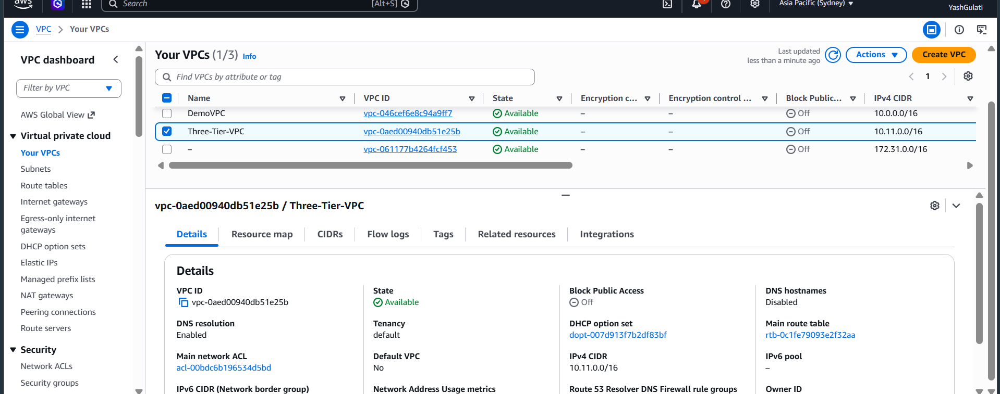

# AWS Three-Tier Architecture

A hands-on AWS project where I built a three-tier application architecture using Amazon VPC, EC2, Application Load Balancer, Bastion Host, and Amazon RDS for MySQL.

The project focuses on understanding AWS networking, security, private and public subnets, load balancing, database connectivity, and application failover.

## Architecture Overview

This project follows a three-tier architecture:

- **Presentation Tier** – Application Load Balancer
- **Application Tier** – EC2 application servers in private subnets
- **Database Tier** – Amazon RDS MySQL in private database subnets
- **Administration** – Bastion Host for controlled SSH access

### Architecture Diagram

```text
                         INTERNET
                             |
                             v
                    Internet Gateway
                             |
                             v
                Application Load Balancer
                       (Public Tier)
                             |
                 HTTP : 80 / Health Checks
                             |
              +--------------+--------------+
              |                             |
              v                             v
       App Server 1                 App Server 2
       Private Subnet                Private Subnet
       AZ: ap-southeast-2a           AZ: ap-southeast-2b
              |                             |
              +--------------+--------------+
                             |
                        MySQL : 3306
                             |
                             v
                     Amazon RDS MySQL
                     (Database Tier)


        ADMINISTRATION ACCESS

             Administrator
                   |
                SSH : 22
                   v
             Bastion Host
             (Public Tier)
                   |
                SSH : 22
                   v
          Private App Servers


## ☁️ AWS Services Used

| Service | Purpose |
|---|---|
| **Amazon VPC** | Provides the isolated network for the application |
| **Amazon EC2** | Hosts the application servers |
| **Application Load Balancer** | Receives internet traffic and distributes it across healthy application servers |
| **Target Group** | Registers application servers and performs health checks |
| **Amazon RDS for MySQL** | Provides the private database tier |
| **Internet Gateway** | Provides internet connectivity for the public tier |
| **Route Tables** | Control traffic routing between subnets and the internet |
| **Security Groups** | Control inbound and outbound traffic between tiers |
| **Bastion Host** | Provides controlled SSH access to private EC2 instances |
| **AWS IAM** | Controls permissions for AWS resources |
| **Linux systemd** | Keeps the application web service running and starts it automatically after reboot |


## 🌐 VPC Design

The project uses a dedicated Amazon VPC to isolate the application infrastructure.

| Component | Configuration |
|---|---|
| **VPC Name** | `Three-Tier-VPC` |
| **CIDR Block** | `10.11.0.0/16` |
| **AWS Region** | `ap-southeast-2 (Sydney)` |


### Subnet Layout

The VPC is divided into three logical tiers: Public, Application, and Database.

| Tier | Subnet | CIDR Block | Availability Zone |
|---|---|---|---|
| Public | `public-subnet-1` | `10.11.1.0/24` | `ap-southeast-2a` |
| Public | `public-subnet-2` | `10.11.2.0/24` | `ap-southeast-2b` |
| Application | `app-subnet-1` | `10.11.11.0/24` | `ap-southeast-2a` |
| Application | `app-subnet-2` | `10.11.12.0/24` | `ap-southeast-2b` |
| Database | `database-subnet-1` | `10.11.21.0/24` | `ap-southeast-2a` |
| Database | `database-subnet-2` | `10.11.22.0/24` | `ap-southeast-2b` |

The six subnets are distributed across two Availability Zones to provide network segmentation and improve application availability.


## 🛣️ Routing Design
Three route tables were created to control traffic for the different tiers.

### Public Route Table
The public subnets are associated with `public-rt`.
10.11.0.0/16 → local
0.0.0.0/0    → Internet Gateway
The public route table is associated with both public subnets.
##Application Route Table
The application subnets are associated with app-rt.
10.11.0.0/16 → local
There is no direct route to the Internet Gateway, keeping the application servers private.
##Database Route Table
The database subnets are associated with database-rt.
10.11.0.0/16 → local
The database tier also has no direct internet route.
This routing design separates the public, application, and database tiers and prevents the private application and database resources from being directly exposed to the internet.

## 🔐 Security Group Architecture

Security groups were configured to allow only the required communication between the different tiers.

| Security Group | Inbound Access | Purpose |
|---|---|---|
| **`alb-public-sg`** | HTTP `80` from `0.0.0.0/0` | Allows internet users to access the Application Load Balancer |
| **`app-server-sg`** | HTTP `80` from `alb-public-sg`<br>SSH `22` from `bastion-sg` | Allows application traffic from the ALB and administrative SSH access from the Bastion Host |
| **`database-sg`** | MySQL `3306` from `app-server-sg` | Allows database connections only from the application servers |
| **`bastion-sg`** | SSH `22` from My IP | Allows administrative access to the Bastion Host |

The application servers and database do not allow direct internet access. Traffic between tiers is restricted using security group references instead of allowing broad CIDR ranges.

### Traffic Flow

```text
Internet
   |
   | HTTP : 80
   v
Application Load Balancer
   |
   | HTTP : 80
   v
Application Servers
   |
   | MySQL : 3306
   v
Amazon RDS MySQL

Administrator
   |
   | SSH : 22
   v
Bastion Host
   |
   | SSH : 22
   v
Application Servers

## ⚖️ Application Load Balancer

An internet-facing Application Load Balancer was created in the public subnets to receive incoming HTTP traffic and distribute requests across the application servers.

| Component | Configuration |
|---|---|
| **Load Balancer** | `three-tier-alb` |
| **Type** | Application Load Balancer |
| **Scheme** | Internet-facing |
| **IP Address Type** | IPv4 |
| **Listener** | HTTP : 80 |
| **Availability Zones** | `ap-southeast-2a`, `ap-southeast-2b` |
| **Target Group** | `app-target-group` |

The ALB forwards HTTP requests to the application servers in the private application subnets.

### Health Checks

The target group performs HTTP health checks on the application servers using port `80`.

Only healthy targets receive traffic from the Application Load Balancer.

```text
Internet
    |
    | HTTP : 80
    v
Application Load Balancer
    |
    +------------+------------+
    |                         |
    v                         v
App Server 1              App Server 2
Private Subnet            Private Subnet

## 🖥️ Application Servers

Two Amazon EC2 instances were deployed in separate private application subnets across two Availability Zones.

| Component | App Server 1 | App Server 2 |
|---|---|---|
| **Instance** | `app-server-1` | `app-server-2` |
| **Subnet** | `app-subnet-1` | `app-subnet-2` |
| **Availability Zone** | `ap-southeast-2a` | `ap-southeast-2b` |
| **Public IP** | None | None |
| **Security Group** | `app-server-sg` | `app-server-sg` |
| **Web Port** | HTTP `80` | HTTP `80` |

The application servers are placed in private subnets and do not have public IP addresses. Incoming application traffic is allowed only from the Application Load Balancer.

A lightweight Python HTTP server was used to host the application pages, with `systemd` configured to automatically start and restart the web service.

### High Availability

The two application servers are deployed across different Availability Zones. The Application Load Balancer monitors their health and routes traffic only to healthy targets.

If one application server becomes unavailable, the ALB can continue serving traffic through the remaining healthy application server.

## 🗄️ Amazon RDS MySQL

Amazon RDS for MySQL was used as the database tier of the three-tier architecture.

| Component | Configuration |
|---|---|
| **DB Identifier** | `three-tier-db` |
| **Engine** | MySQL |
| **Instance Class** | `db.t3.micro` |
| **Storage** | 20 GiB gp3 |
| **Port** | `3306` |
| **Public Access** | No |
| **Security Group** | `database-sg` |
| **DB Subnet Group** | `three-tier-db-subnet-group` |
| **Subnets** | `database-subnet-1`, `database-subnet-2` |

The RDS database is deployed without public access in the private database subnets.

Access to MySQL on port `3306` is restricted to the application servers through `database-sg`.

```text
Application Servers
        |
        | MySQL : 3306
        v
   database-sg
        |
        v
   Amazon RDS MySQL

## 🛡️ Bastion Host

A Bastion Host was deployed in the public subnet to provide controlled administrative SSH access to the private application servers.

| Component | Configuration |
|---|---|
| **Instance** | `three-tier-bastion` |
| **Subnet** | Public Subnet |
| **Security Group** | `bastion-sg` |
| **SSH Port** | `22` |
| **Application Server Access** | SSH through `app-server-sg` |

The Bastion Host is the only entry point for administrative SSH access to the private application servers.

```text
Administrator
      |
      | SSH : 22
      v
Bastion Host
      |
      | SSH : 22
      v
Private App Servers

## 🔑 IAM and Systems Manager

An IAM role was created for the EC2 application servers to provide controlled access to AWS services without storing long-term AWS access keys on the instances.

| Component | Configuration |
|---|---|
| **IAM Role** | `three-tier-ec2-ssm-role` |
| **Attached To** | Application EC2 instances |
| **Purpose** | Provides AWS permissions to the EC2 instances |
| **Management** | AWS IAM |

The EC2 instances use an IAM role instead of storing AWS access keys directly on the servers.

AWS Systems Manager can also be used for secure instance management without requiring the application servers to have public IP addresses.

This improves security by keeping credentials out of the EC2 instances and reducing the need for direct administrative access.

## 🔄 Application Failover Testing

The architecture was tested by making one application server unavailable and verifying that the Application Load Balancer continued serving traffic through the remaining healthy server.

### Test Scenario

```text
Before Failure

             ALB
            /   \
           v     v
      App Server 1   App Server 2
        Healthy         Healthy
After Failure

             ALB
              |
              v
        App Server 1
           Healthy

        App Server 2
           Stopped
The Target Group health check detected that the stopped instance was no longer available and marked it as unavailable.
The ALB continued forwarding requests to the remaining healthy application server.
This demonstrates application-level high availability and automatic failover using an Application Load Balancer.

## 🧪 Connectivity Testing

Connectivity between the different tiers was tested to verify that the security groups and network routing were working as expected.

### Application Server → RDS

A TCP connectivity test was performed from the application server to the private RDS endpoint on MySQL port `3306`.

```text
App Server
    |
    | TCP : 3306
    v
RDS MySQL

## ⚙️ Web Service Automation

A lightweight Python HTTP server was used to serve the application pages on port `80`.

To ensure the web service remains available after reboots or unexpected failures, a Linux `systemd` service was configured on both application servers.

The service was configured with:

- Automatic startup after system boot
- Automatic restart if the service stops
- HTTP service on port `80`
- Application content served from `/tmp`

```text
EC2 Instance
     |
     v
systemd
     |
     v
Python HTTP Server : 80
     |
     v
Application Page

## 💰 Cost Optimization

The project was designed with cost awareness in mind by using small instance types and stopping resources when they were not required for testing.

Cost considerations included:

- Using `t3.micro` EC2 instances for the application tier
- Using `db.t3.micro` for Amazon RDS MySQL
- Stopping EC2 instances when not actively testing
- Stopping the RDS instance when not required
- Avoiding unnecessary NAT Gateway usage because of its hourly and data-processing charges
- Monitoring AWS Billing to track project costs

The project was primarily built as a hands-on learning environment, with a focus on keeping unnecessary AWS charges low while still demonstrating a production-style three-tier architecture.
